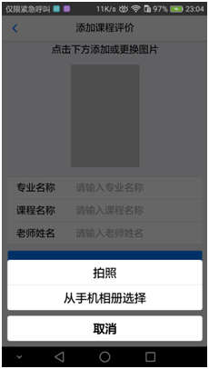
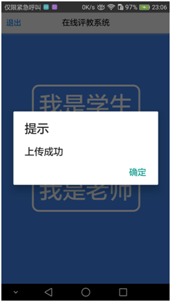
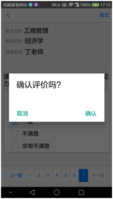
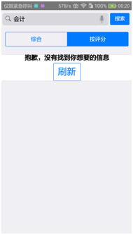

# Mui_OnlineAppraise_SSM

基于Mui HTML5+plus的学生评教App应用

#### 目的：

通过该项目掌握SSM简单的数据增删查改和文件上传

#### 技术方案：

前端：Mui，H5+plus

后端：Spring+SpringMVC+MyBatis

#### 实现功能要点：

- 老师上传需评教的课程
- 学生对已上传的课程进行评价
- 学生评价成功后评分实时反馈显示
- 学生不能对同一课程重复评价

#### 部分功能截图：

#### IDE：

- Hbuilder，Android真机调试
- IDEA，服务器端

#### 写在最后

由于该项目完成的时间较为仓促，用户登录模块，异常处理，网络处理等细节并未完善，以后将加以完善

本项目从设计到前后端实现均由个人完成

PS：本人大四菜鸟一个，本项目只为SSM的练习和学习所用，有事请加QQ:907565284